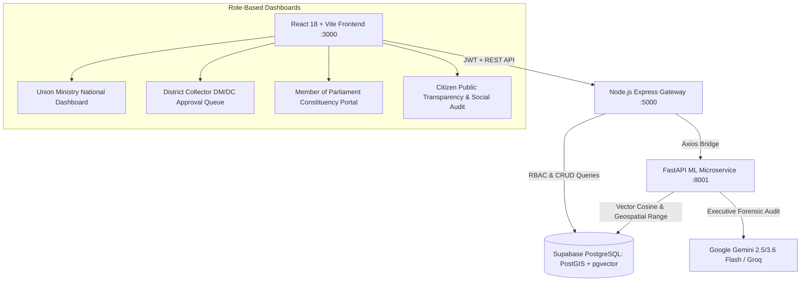

# MPLADS-AI: National Monitoring, Forensic Vigilance & Anti-Fraud Platform

[](https://opensource.org/licenses/MIT)
[](https://fastapi.tiangolo.com/)
[](https://expressjs.com/)
[](https://react.dev/)
[](https://tailwindcss.com/)
[](https://supabase.com/)
[](https://ai.google.dev/)

An enterprise-grade, full-stack AI platform built for the **Members of Parliament Local Area Development Scheme (MPLADS)** under the Ministry of Statistics and Programme Implementation (MoSPI), Government of India. The platform eliminates fund leakage, double invoicing, ghost assets, and contractor cartels through automated multi-modal machine learning, pgvector semantic search, PostGIS geospatial collision analysis, and Gemini-powered forensic audit dossiers.

---

## 🏛️ System Architecture



---

## 🚀 Key Modules & Capabilities

### 1. Database Architecture & Synthetic Ingestion (`/scripts`)
- **Extensions**: Supabase PostgreSQL with `postgis`, `vector`, `uuid-ossp`, and `pgcrypto`.
- **Dataset**: Ingested **520 projects** across 6 states (Karnataka, Maharashtra, Bihar, Kerala, Punjab, Uttar Pradesh) with dense **384-dimensional vector embeddings** (`all-MiniLM-L6-v2`) and synchronized PostGIS geometries.
- **Labeled Ground-Truth Vigilance Set**: Exactly **78 flagged anomalies (15.00%)**:
  - `DUPLICATE_WORK`: 20 projects (10 collision pairs $< 35\text{m}$ apart, cosine similarity $> 0.77$).
  - `GHOST_PROJECT`: 20 projects (90–99% disbursed funds against $3-17\%$ physical progress).
  - `COST_OVERRUN`: 20 projects ($3.55\times - 4.45\times$ regional work category median).
  - `VENDOR_MONOPOLY`: 18 projects in Dharwad district awarded to a single cartel contractor ($>75\%$ market share).

### 2. Python FastAPI ML Microservice (`/ml-service`)
- **Semantic Duplicate Detection**: `sentence-transformers` + pgvector cosine distance ($< 0.15$) + PostGIS spatial proximity ($ST\_Distance < 200\text{m}$).
- **Financial Anomaly Scoring**: `IsolationForest` combined with statistical Schedule of Rates (SoR) $z$-score analysis.
- **Completion Delay Regressor**: `XGBoostRegressor` trained on civil works budgets, executing agencies, and monsoon seasonality.
- **Milestone Photo Fraud Engine**: 64-bit perceptual image hashing (`imagehash.phash`) detecting recycled photos (Hamming distance $\le 8$ bits).
- **Forensic Audit Agent**: Google GenAI (`gemini-3.6-flash`/`gemini-2.5-flash`) generating authoritative 2-sentence executive audit summaries.

### 3. Node.js / Express Backend & RBAC Gateway (`/backend`)
- **Role-Based Access Control**: 6 authenticated tiers (`MINISTRY`, `STATE_NODAL`, `DISTRICT_COLLECTOR`, `MP`, `AGENCY`, `CITIZEN`).
- **Dual Password Hashing**: Supports PBKDF2-SHA256 for seeded accounts and bcrypt for new registrations.
- **Automated ML Screening**: Proposal recommendations automatically invoke ML duplicate checks and cost scoring before saving.
- **GeoJSON Endpoint**: Generates valid GeoJSON `FeatureCollection` for real-time Leaflet GIS mapping.

### 4. Modern React / Vite Frontend (`/frontend`)
- **Civic-Tech Theme**: Dark/Light mode toggle, Tailwind CSS, Lucide React icons.
- **Interactive GIS Map**: 520+ color-coded risk markers with click-to-open audit dossiers.
- **1-Click Persona Switcher**: Instantaneously switch between Ministry, District Collector, MP, Implementing Agency, and Citizen Auditor without re-entering credentials.
- **One-Click Audit Dossier**: Modal with Gemini AI analysis, GPS coordinates, financial ratios, contractor profiles, and milestone logs.

---

## 📁 Repository Structure

```
.
├── .env.example                # Template environment variables (Do NOT commit .env)
├── .gitignore                  # Git ignore rules for node_modules, venv, secrets, caches
├── README.md                   # Project documentation
│
├── backend/                    # Phase 3: Node.js Express REST API Gateway
│   ├── package.json
│   ├── test_backend.js         # Automated test suite (10 test suites)
│   ├── src/
│   │   ├── app.js              # Express app & security middleware
│   │   ├── server.js           # Server entrypoint (Port 5000)
│   │   ├── config/             # DB connection pool with connection sanitization
│   │   ├── middleware/         # JWT verification & RBAC guards
│   │   ├── services/           # Axios bridge to /ml-service
│   │   ├── controllers/        # Auth, Projects, Milestones, Analytics, Alerts
│   │   └── routes/             # REST route definitions
│   └── README.md
│
├── ml-service/                 # Phase 2: Python FastAPI ML Microservice
│   ├── main.py                 # FastAPI server (Port 8001)
│   ├── config.py               # Settings & database connection
│   ├── requirements.txt        # Python package dependencies
│   ├── test_api.py             # Integration tests for all 5 ML routes
│   ├── routes/                 # API endpoint routers
│   ├── services/               # Duplicate, Cost Anomaly, Timeline, Image, Audit engines
│   └── README.md
│
├── frontend/                   # Phase 4: Modern React Vite Frontend
│   ├── index.html              # HTML entrypoint with Leaflet CSS
│   ├── package.json            # React 18, Vite, Tailwind, Leaflet, Recharts
│   ├── vite.config.js          # Vite config & API proxy
│   ├── tailwind.config.js      # Dark mode & custom Gov theme
│   ├── src/
│   │   ├── main.jsx            # Application root
│   │   ├── App.jsx             # Routes & protected layout
│   │   ├── context/            # AuthContext & ThemeContext
│   │   ├── services/           # Axios API client
│   │   ├── components/         # Navbar, Sidebar, LeafletMap, Cards, Modals
│   │   └── pages/              # Ministry, Collector, MP, Citizen dashboards
│   └── README.md
│
└── scripts/                    # Phase 1: Database Setup & Synthetic Data Ingestion
    ├── schema.sql              # PostgreSQL DDL with PostGIS & vector extensions
    ├── migrate.py              # Migration runner
    ├── seed.py                 # Seeds 520 projects with 384-dim embeddings & anomalies
    ├── verify_phase1.py        # Automated test verification for Phase 1
    └── README.md
```

---

## 👥 Evaluation Personas & Login Credentials

A common password is set for all 24 seeded official accounts:  
**Password:** `MPLADS@Secure2025!`

| Persona Role | Name & Designation | Email | Jurisdiction Scope |
|--------------|-------------------|-------|--------------------|
| **`MINISTRY`** | Shri Rajesh Kumar, IAS | `admin.ministry@mplads.gov.in` | National Oversight |
| **`DISTRICT_COLLECTOR`** | Divya Prabhu G.R.J., IAS | `collector.dharwad@mplads.gov.in` | Dharwad District, Karnataka |
| **`MP`** | Hon. Pralhad Joshi | `mp.dharwad@sansad.nic.in` | Dharwad Lok Sabha Constituency |
| **`AGENCY`** | Executive Engineer, PWD | `agency.pwd@mplads.gov.in` | Dharwad Division |
| **`CITIZEN`** | Ramesh Kulkarni (Auditor) | `citizen.auditor@mplads.gov.in` | Public Transparency |

> **Pro Tip:** In the frontend application, use the **1-Click Persona Switcher** dropdown in the top navigation bar or on the login page to immediately test any role without manual typing.

---

## 🛠️ Step-by-Step Installation & Quickstart

### Prerequisites
- Node.js `v18+` or `v20+` (tested on Node v24)
- Python `3.10+` (tested on Python 3.12)
- Supabase PostgreSQL instance with `postgis` and `vector` extensions

### Step 1: Environment Setup
Duplicate `.env.example` to `.env`:
```bash
cp .env.example .env
cp .env.example backend/.env
cp .env.example ml-service/.env
```
Fill in your Supabase connection string and API keys.

---

### Step 2: Database Migration & Seeding
From the repository root:
```bash
python -m venv venv
# Windows:
.\venv\Scripts\activate
# Linux/macOS:
source venv/bin/activate

pip install -r scripts/requirements.txt
python scripts/migrate.py
python scripts/seed.py
python scripts/verify_phase1.py
```

---

### Step 3: Start the Python FastAPI ML Microservice (Port 8001)
```bash
cd ml-service
pip install -r requirements.txt
python main.py
```
- **Service URL**: `http://127.0.0.1:8001`
- **Interactive Swagger Docs**: `http://127.0.0.1:8001/docs`
- **Test Suite**: `python test_api.py`

---

### Step 4: Start the Node.js Express Gateway (Port 5000)
In a second terminal:
```bash
cd backend
npm install
npm start
```
- **Service URL**: `http://localhost:5000`
- **Health Check**: `http://localhost:5000/health`
- **Test Suite**: `npm test`

---

### Step 5: Start the React Vite Frontend (Port 3000)
In a third terminal:
```bash
cd frontend
npm install
npm run dev
```
- Open `http://localhost:3000` in your web browser.

---

## 🧪 Automated Test Suites

Each tier includes automated integration tests:

| Tier | Command | Validations |
|------|---------|-------------|
| **Phase 1 Database** | `python scripts/verify_phase1.py` | 520 records, 384-dim embeddings, active PostGIS triggers, 15.00% anomaly ratio |
| **Phase 2 ML Service** | `python ml-service/test_api.py` | Duplicate engine, Isolation Forest, XGBoost delay regressor, pHash, Gemini 2-sentence summary |
| **Phase 3 Express Gateway** | `npm test` *(in /backend)* | 10 test suites validating RBAC, JWT, ML bridge, milestone approvals, GeoJSON, and alert updates |
| **Phase 4 Frontend SPA** | `npm run build` *(in /frontend)* | Production bundle compilation (2,327 modules transformed, 0 errors) |

---

## 📜 License & Compliance
This project is licensed under the MIT License. Developed in compliance with the **MPLADS Guidelines 2023** published by the Ministry of Statistics and Programme Implementation (MoSPI), Government of India.
